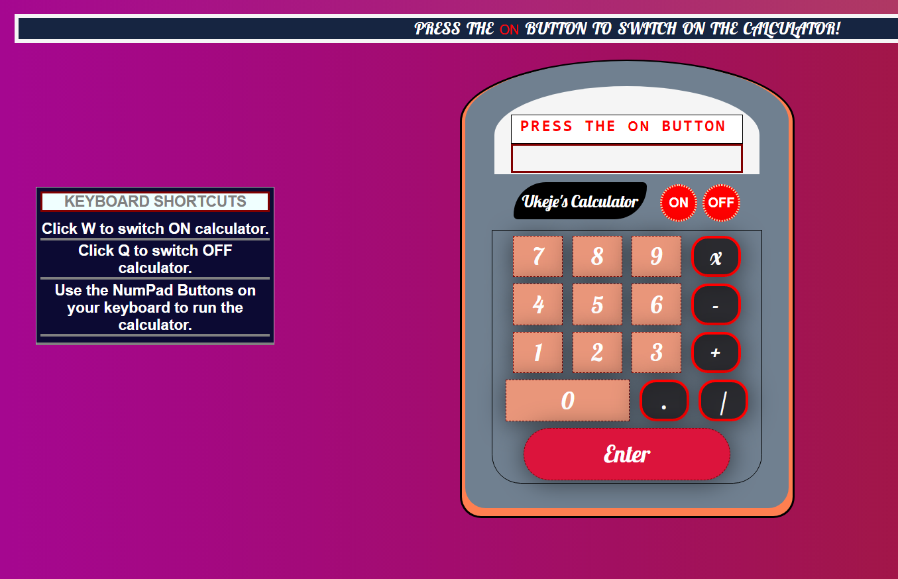

[![Contributors][contributors-shield]][contributors-url]
[![Issues][issues-shield]][issues-url]
[![MIT License][license-shield]][license-url]

# JavaScript-Calculator-Project

 

  

  <h3 align="center">
	 JavaScript-Calculator-Project
  </h3>

  <h3 align="center">
	 Live Version - https://mikenath223.github.io/Js-Calculator-Project/
  </h3>

  

    A javascript powered calculator with keyboard integrated support.    
     
    <a href="https://github.com/mikenath223/Js-Calculator-Project/blob/master/README.md"><strong>Explore the docs 📚</strong></a>
     
     
	  🖊️
    <a href="https://www.theodinproject.com/courses/web-development-101/lessons/calculator">Assigment</a>
    🐛
    <a href="https://github.com/mikenath223/Js-Calculator-Project/issues">Report Bug</a>
    🙏
    <a href="https://github.com/mikenath223/Js-Calculator-Project/issues">Request Feature</a>
  

# Validations

- W3c Html validator - https://validator.w3.org/
- Stickler css linter

# Get Started
- Checkout the project the project at the live version link

# Features

* Followed the [tutotial](https://www.theodinproject.com/courses/web-development-101/lessons/calculator)
* Included numpad keyboard functionality.

## Built With

- Passion for code 💜
- `HTML5`
- `CSS3`
- `vscode editor` with _HTML5_ and _CSS3_ extensions
- Windows OS

# Author

* [Ukeje Michgolden](https://github.com/mikenath223)

# License

This project is licensed under the MIT License - see the [LICENSE.md](LICENSE.md) file for details 

<!-- ACKNOWLEDGEMENTS -->
## Acknowledgements
* [Microverse](https://www.microverse.org/)
* [The Odin Project](https://www.theodinproject.com/)

<!-- MARKDOWN LINKS & IMAGES -->
<!-- https://www.markdownguide.org/basic-syntax/#reference-style-links -->
[issues-shield]: https://img.shields.io/github/issues/mikenath223/Js-Calculator-Project
[issues-url]: https://github.com/mikenath223/Js-Calculator-Project/issues
[license-shield]: https://img.shields.io/github/license/mikenath223/Js-Calculator-Project
[license-url]: https://github.com/mikenath223/Js-Calculator-Project/blob/master/LICENSE.txt